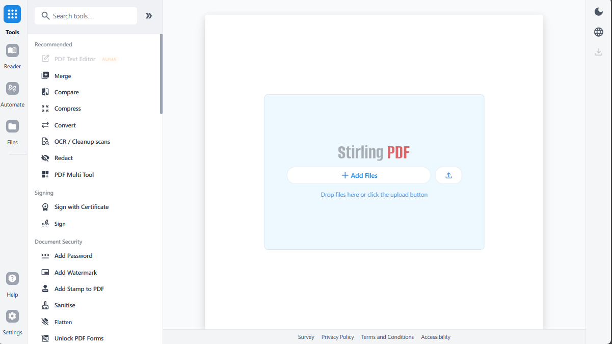

<p align="center">
  
</p>

<h1 align="center">PHD Smart Tools — Internal Document Toolkit</h1>

PHD Smart Tools is PHD Nigeria's internal PDF editing platform, adapted from the open-source [Stirling-PDF](https://github.com/Stirling-Tools/Stirling-PDF) project. Run it in the browser or deploy it on internal servers with a private API. Edit, sign, redact, convert, and automate PDFs without sending documents to external services.



## Key Capabilities

- **Browser UI and self-hosted server** with a private API.
- **50+ PDF tools** - Edit, merge, split, sign, redact, convert, OCR, compress, and more.
- **Automation & workflows** - No-code pipelines direct in UI with APIs to process documents at scale.
- **Internal deployment** - Runs entirely within PHD Nigeria's infrastructure; no documents leave the network.

## Quick Start

```bash
docker run -p 8080:8080 phd-smart-tools
```

Then open: http://localhost:8080

## Internal Resources

- Maintained by: PHD Nigeria IT
- Original upstream project: [Stirling-PDF](https://github.com/Stirling-Tools/Stirling-PDF) (Apache 2.0 / proprietary dual-license — see LICENSE)

- [**API Docs**](https://registry.scalar.com/@stirlingpdf/apis/stirling-pdf-processing-api/)
- [**Server Plan & Enterprise**](https://docs.stirlingpdf.com/Paid-Offerings)

## Support

- **Community** [Discord](https://discord.gg/HYmhKj45pU)
- **Bug Reports**: [Github issues](https://github.com/Stirling-Tools/Stirling-PDF/issues)

## Contributing

We welcome contributions! Please see [CONTRIBUTING.md](CONTRIBUTING.md) for guidelines.

This project uses [Task](https://taskfile.dev/) as a unified command runner for all build, dev, and test commands. Run `task dev` to get started running the editor, run `task` to see the most common commands, or see the [Developer Guide](DeveloperGuide.md) for full details.

For adding translations, see the [Translation Guide](devGuide/HowToAddNewLanguage.md).

## License

Stirling PDF is open-core. See [LICENSE](LICENSE) for details.
